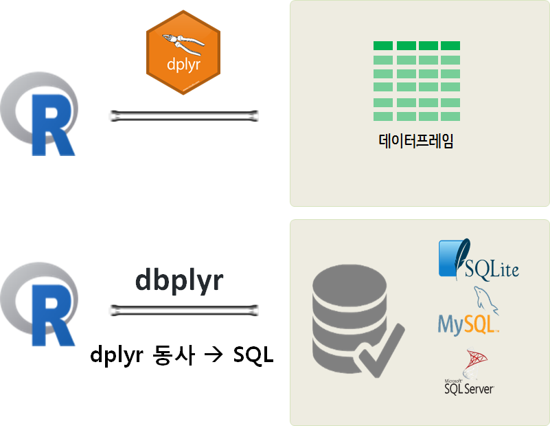
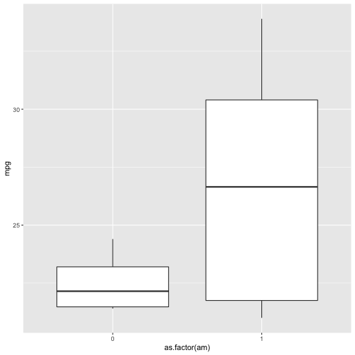

---
# Please do not edit this file directly; it is auto generated.
# Instead, please edit 06-dataframe-sql.md in _episodes_rmd/
title: "데이터프레임과 SQL - 4월20일"
teaching: 180
exercises: 0
questions:
- "데이터베이스 언어 SQL을 들어보셨나요?"
- "데이터프레임을 어떻게 조작할 수 있을까?"
objectives:
- "행 혹은 칼럼을 추가하고 제거한다."
- "`NA` 값을 갖는 행을 제거한다."
- "데이터프레임 두개를 붙인다."
- "`요인(factor)`가 무엇인지 이해한다."
- "요인형 벡터를 문자형 벡터로 변환시킨다. 역으로도 수행해본다."
- "칼럼의 크기, 클래스, 칼럼명, 첫 몇 행을 포함하는 데이터프레임 기본 특성을 출력한다."
keypoints:
- "`cbind()` 함수를 사용해서 데이터프레임에 칼럼을 추가한다."
- "`rbind()` 함수를 사용해서 데이터프레임에 행을 추가한다."
- "데이터프레임에서 행을 제거한다."
- "`na.omit()` 명령문을 사용해서, `NA` 값을 갖는 행을 데이터프레임에서 제거한다."
- "`levels()`과 `as.character()` 함수를 사용해서 요인을 타맥하고 조작한다."
- "`str()`, `nrow()`, `ncol()`, `dim()`, `colnames()`, `rownames()`, `head()`, `typeof()` 함수를 사용해서 데이터프레임 구조를 파악한다."
- "`read.csv()` 함수를 사용해서 CSV 파일을 불러온다."
- "데이터프레임 `length()`가 나타내는 것이 무엇인지 이해한다."
source: Rmd
editor_options: 
  chunk_output_type: console
---


R의 모든 기본 자료형과 자료구조에 대한 여행을 마쳤다.
여러분이 수행하는 모든 작업은 이러한 도구를 조작하는 것이 된다.
하지만, 거의 대부분 쇼의 진정한 스타는 데이터프레임이다 - `csv` 파일에 정보를 불러와서 생성시킨 테이블.

`csv`, `tsv` 파일과 같은 파일을 R이나 다른 데이터베이스 시스템에서 관계형 데이터(Relational Data)로 많이 다룬다. 장점은 데이터가 일부 변형되었을 때 전부를 변경시킬 필요가 없이 변경된 일부분만 바꾼다는 점에서 큰 장점이 있다. R에서 데이터 과학자로서 혹은 데이터 분석가로서 많이 다루는 데이터가 관계형 데이터 데이터프레임이다. 

관계형 데이터 크기가 작은 경우 PC에서 데이터프레임으로 처리하면 되는데 데이터 크기가 PC 메모리 크기를 넘어가는 경우 외부 데이터베이스에 데이터를 저장하고 이를 쿼리해서 처리하는 방식을 많이 취한다. 최근에는 이를 더 확장한 개념의 하둡/스파크와 같은 NoSQL 형태 데이터도 많이 다뤄지고 있다.



# 데이터프레임(데이터프레임) 

## 데이터프레임에 행과 열을 추가하기 

데이터프레임의 칼럼은 벡터라는 것을 배웠다.
따라서, 데이터는 칼럼에서 자료형의 일관성을 유지해야 한다.
이를테면, 칼럼을 새로 추가하려면 벡터를 새로 만들어서 시작한다:


~~~
age <- c(2, 3, 5)
cats
~~~
{: .language-r}


~~~
    coat weight likes_string
1 calico    2.1            1
2  black    5.0            0
3  tabby    3.2            1
~~~
{: .output}

`age`를 칼럼으로 다음과 같이 추가한다:


~~~
cbind(cats, age)
~~~
{: .language-r}


~~~
    coat weight likes_string age
1 calico    2.1            1   2
2  black    5.0            0   3
3  tabby    3.2            1   5
~~~
{: .output}

데이터프레임의 행의 갯수와 다른 갯수를 갖는 `age` 벡터를 추가하게되면 추가되지 않고 오류가 발생됨에 주의한다:


~~~
age <- c(2, 3, 5, 12)
cbind(cats, age)
~~~
{: .language-r}


~~~
Error in data.frame(..., check.names = FALSE): arguments imply differing number of rows: 3, 4
~~~
{: .error}


~~~
age <- c(2, 3)
cbind(cats, age)
~~~
{: .language-r}


~~~
Error in data.frame(..., check.names = FALSE): arguments imply differing number of rows: 3, 2
~~~
{: .error}

왜 정상동작이 되지 않을까? 
R은 테이블의 모든 행마다, 신규 칼럼에서도 원소 하나가 있길 원한다:


~~~
nrow(cats)
~~~
{: .language-r}


~~~
[1] 3
~~~
{: .output}


~~~
length(age)
~~~
{: .language-r}


~~~
[1] 2
~~~
{: .output}

그래서, 정상 동작하려면 `nrow(cats)` = `length(age)`이 되어야 한다.
`cats` 콘텐츠를 새로운 데이터프레임으로 덮어써보자.


~~~
age <- c(2, 3, 5)
cats <- cbind(cats, age)
~~~
{: .language-r}

이제 행을 추가하면 어떻게 될까?
이미 데이터프레임의 행이 리스트라는 사실을 알고 있다:


~~~
newRow <- list("tortoiseshell", 3.3, TRUE, 9)
cats <- rbind(cats, newRow)
~~~
{: .language-r}


~~~
Warning in `[<-.factor`(`*tmp*`, ri, value = "tortoiseshell"): 요인의 수준
(factor level)이 올바르지 않아 NA가 생성되었습니다.
~~~
{: .error}

## 요인 (Factors)

살펴볼 것이 하나더 있다: `요인(factor)`에서 각기 다른 값을 `수준(level)`이라고 한다.
요인형 "coat" 변수는 수준이 3으로 구성된다: "black", "calico", "tabby". 
R은 세가지 수준 중 하나와 매칭되는 값만 받아들인다.
완전 새로운 값을 추가하게 되면, 추가되는 신규 값은 `NA`가 된다.

경고 메시지를 통해서 *coat* 요인변수에 "tortoiseshell" 값을 추가하는데 성공하지 못했다고 알려준다.
하지만, 3.3 (숫자형), TRUE (논리형), and 9 (숫자형) 모두 *weight*, *likes_string*, *age* 변수에 
성공적으로 추가된다. 왜냐하면 변수가 요인형이 아니라서 그렇다.
"tortoiseshell"을 *coat* 요인변수에 성공적으로 추가하려면, 요인의 수준(level)로 "tortoiseshell"을 추가하면 된다:


~~~
levels(cats$coat)
~~~
{: .language-r}


~~~
[1] "black"  "calico" "tabby" 
~~~
{: .output}


~~~
levels(cats$coat) <- c(levels(cats$coat), "tortoiseshell")
cats <- rbind(cats, list("tortoiseshell", 3.3, TRUE, 9))
~~~
{: .language-r}

대안으로, 요인형 벡터를 문자형 벡터로 변환시키면 된다;
요인변수의 범주를 잃게 되지만, 요인 수준을 조심스럽게 다룰 필요없이, 
칼럼에 추가하고자 하는 임의 단어를 추가하면 된다:


~~~
str(cats)
~~~
{: .language-r}


~~~
'data.frame':	5 obs. of  4 variables:
 $ coat        : Factor w/ 4 levels "black","calico",..: 2 1 3 NA 4
 $ weight      : num  2.1 5 3.2 3.3 3.3
 $ likes_string: int  1 0 1 1 1
 $ age         : num  2 3 5 9 9
~~~
{: .output}


~~~
cats$coat <- as.character(cats$coat)
str(cats)
~~~
{: .language-r}


~~~
'data.frame':	5 obs. of  4 variables:
 $ coat        : chr  "calico" "black" "tabby" NA ...
 $ weight      : num  2.1 5 3.2 3.3 3.3
 $ likes_string: int  1 0 1 1 1
 $ age         : num  2 3 5 9 9
~~~
{: .output}

> ## 도전과제 1
> 
> 1. `cats$age` 벡터에 7을 곱해서 `human_age` 벡터를 생성하자.
> 2. `human_age`를 요인형으로 변환시키자.
> 3. `as.numeric()` 함수를 사용해서 `human_age` 벡털르 다시 숫자형 벡터로 변환시킨다.
>    이제 7로 나눠서 원래 고양이 나이로 되돌리자. 무슨 일이 생겼는지 설명하자.
>
> > ## 도전과제 1에 대한 해답
> > 1. `human_age <- cats$age * 7`
> > 2. `human_age <- factor(human_age)`. `as.factor(human_age)` works just as well.
> > 3. `as.numeric(human_age)`을 실행하면 `1 2 3 4 4`이 된다.
> > 왜냐하면 요인형 변수는 정수형(여기서 1:4)으로 자료를 저장하기 때문이다. 
> > 정수 라벨과 연관된 값은 여기서 28, 35, 56, 63이다.
> > 요인형 변수를 숫자형 벡터로 변환시키면 라벨이 아니라 그 밑단의 정수를 반환시킨다.
> > 원래 숫자를 원하는 경우, `human_age`를 문자형 벡터로 변환시키고 나서 숫자형 벡터로 변환시키면 된다.(왜 이방식은 정장 동작할까?) 
> > 실수로 숫자만 담긴 칼럼 어딘가 문자가 포함된 csv 파일로 작업할 때 이런 일이 실제로 종종 일어난다.
> > 데이터를 불러 읽어올 때 `stringsAsFactors=FALSE` 설정을 잊지말자.
> {: .solution}
{: .challenge}

## 행 제거

이제 데이터프레임에 행과 열을 추가하는 방법을 알게 되었다 - 하지만, 
데이터프레임에 "tortoiseshell" 고양이를 처음으로 추가하면서, 우연히 
쓰레기 행을 추가시켰다:


~~~
cats
~~~
{: .language-r}


~~~
           coat weight likes_string age
1        calico    2.1            1   2
2         black    5.0            0   3
3         tabby    3.2            1   5
4          <NA>    3.3            1   9
5 tortoiseshell    3.3            1   9
~~~
{: .output}

데이터프레임에 문제가 되는 행을 마이너스해서 빼자:


~~~
cats[-4, ]
~~~
{: .language-r}


~~~
           coat weight likes_string age
1        calico    2.1            1   2
2         black    5.0            0   3
3         tabby    3.2            1   5
5 tortoiseshell    3.3            1   9
~~~
{: .output}

`-4,` 다음에 아무것도 적시하지 않아서 4번째 행 전체를 제거함에 주목한다.

주목: 벡터 내부에 행 다수를 넣어 한번에 행을 제거할 수도 있다: `cats[c(-4,-5), ]`

대안으로, `NA` 값을 갖는 모든 행을 제거시킨다:


~~~
na.omit(cats)
~~~
{: .language-r}


~~~
           coat weight likes_string age
1        calico    2.1            1   2
2         black    5.0            0   3
3         tabby    3.2            1   5
5 tortoiseshell    3.3            1   9
~~~
{: .output}

출력결과를 `cats`에 다시 대입하여 변경사항이 데이터프레임이 영구히 남도록 조치한다:


~~~
cats <- na.omit(cats)
~~~
{: .language-r}

## 칼럼 제거

데이터프레임의 칼럼도 제거할 수 있다.
"age" 칼럼을 제거하고자 한다면 어떨까?
변수명과 변수 인덱스, 두가지 방식으로 칼럼을 제거할 수 있다.


~~~
cats[,-4]
~~~
{: .language-r}


~~~
           coat weight likes_string
1        calico    2.1            1
2         black    5.0            0
3         tabby    3.2            1
5 tortoiseshell    3.3            1
~~~
{: .output}

`,-4` 앞에 아무것도 없는 것에 주목한다. 모든 행을 간직한다는 의미를 갖는다.

대안으로, 색인명을 사용해서 컬럼을 제거할 수도 있다.


~~~
drop <- names(cats) %in% c("age")
cats[,!drop]
~~~
{: .language-r}


~~~
           coat weight likes_string
1        calico    2.1            1
2         black    5.0            0
3         tabby    3.2            1
5 tortoiseshell    3.3            1
~~~
{: .output}

## 데이터프레임에 덧붙이기

데이터프레임에 데이터를 추가시킬 때 기억할 것은 **칼럼은 벡터, 행은 리스트**라는 사실이다.
`rbind()` 함수를 사용해서 데이터프레임 두개를 본드로 붙이듯이 결합시킬 수 있다:


~~~
cats <- rbind(cats, cats)
cats
~~~
{: .language-r}


~~~
            coat weight likes_string age
1         calico    2.1            1   2
2          black    5.0            0   3
3          tabby    3.2            1   5
5  tortoiseshell    3.3            1   9
11        calico    2.1            1   2
21         black    5.0            0   3
31         tabby    3.2            1   5
51 tortoiseshell    3.3            1   9
~~~
{: .output}
But now the row names are unnecessarily complicated. We can remove the rownames,
and R will automatically re-name them sequentially:

행명칭(rownames)이 불필요하게 복잡해져, 행명칭을 제거하면,
자동적으로 R이 순차적으로 행명칭을 부여시킨다.


~~~
rownames(cats) <- NULL
cats
~~~
{: .language-r}


~~~
           coat weight likes_string age
1        calico    2.1            1   2
2         black    5.0            0   3
3         tabby    3.2            1   5
4 tortoiseshell    3.3            1   9
5        calico    2.1            1   2
6         black    5.0            0   3
7         tabby    3.2            1   5
8 tortoiseshell    3.3            1   9
~~~
{: .output}

> ## 도전과제 2
>
> 다음 구문을 사용해서 R 내부에서 직접 데이터프레임을 새로 만들 수 있다:
> 
> ~~~
> df <- data.frame(id = c("a", "b", "c"),
>                  x = 1:3,
>                  y = c(TRUE, TRUE, FALSE),
>                  stringsAsFactors = FALSE)
> ~~~
> {: .language-r}
> 다음 정보를 갖는 데이터프레임을 직접 제작해 보자:
>
> - 이름(first name)
> - 성(last name)
> - 좋아하는 숫자
>
> `rbind`를 사용해서 옆사람을 항목에 추가한다.
>  마지막으로 `cbind()`함수를 사용해서 "지금이 커피시간인가요?"라는 질문의 답을 칼럼으로 추가한다. 
>
> > ## 도전과제 2에 대한 해답
> > 
> > ~~~
> > df <- data.frame(first = c("Grace"),
> >                  last = c("Hopper"),
> >                  lucky_number = c(0),
> >                  stringsAsFactors = FALSE)
> > df <- rbind(df, list("Marie", "Curie", 238) )
> > df <- cbind(df, coffeetime = c(TRUE,TRUE))
> > ~~~
> > {: .language-r}
> {: .solution}
{: .challenge}

## 현실적인 예제

지금까지 고양이 데이털르 가지고 데이터프레임 조작에 대한 기본적인 사항을 살펴봤다.
이제 학습한 기술을 사용해서 좀더 현실적인 데이터셋을 다뤄보자.
앞에서 다운로드 받은 `gapminder` 데이터셋을 불러오자:


~~~
gapminder <- read.csv("data/gapminder_data.csv")
~~~
{: .language-r}

> ## 기타 팁
>
> * 흔히 맞닥드리는 또다른 유형의 파일이 탭구분자를 갖는 파일(.tsv)이다. 탭을 구분자로 명세하는데, `"\\t"`을 사용하고, `read.delim()` 함수로 불러 읽어온다.
>
> * 파일을 `download.file()` 함수를 사용해서 인터넷으로부터 직접 본인 컴퓨터 폴더로 다운로드할 수 있다.
>   `read.csv()` 함수를 실행해서 다운로드 받은 파일을 읽어온다. 예를 들어,
> 
> ~~~
> download.file("https://raw.githubusercontent.com/swcarpentry/r-novice-gapminder/gh-pages/_episodes_rmd/data/gapminder_data.csv", destfile = "data/gapminder_data.csv")
> gapminder <- read.csv("data/gapminder_data.csv")
> ~~~
> {: .language-r}
>
> * 대안으로, `read.csv()` 함수 내부에 파일 경로를 웹주소를 치환해서 인터넷에서 직접 파일을 불러올 수도 있다.
>   이런 경우 로컬 컴퓨터에 csv 파일이 전혀 저장되지 않았다는 점을 주의한다. 예를 들어,
> 
> ~~~
> gapminder <- read.csv("https://raw.githubusercontent.com/swcarpentry/r-novice-gapminder/gh-pages/_episodes_rmd/data/gapminder_data.csv")
> ~~~
> {: .language-r}
>
> * [readxl](https://cran.r-project.org/web/packages/readxl/index.html) 팩키지를 사용해서,
>   엑셀 스프레드쉬트를 평범한 텍스트로 변환하지 않고 직접 불러올 수도 있다.
{: .callout}

`gapminder` 데이터셋을 좀더 살펴보자; 항상 가장 먼저 해야되는 작업은 
`str` 명령어로 데이터가 어떻게 생겼는지 확인하는 것이다:


~~~
str(gapminder)
~~~
{: .language-r}


~~~
'data.frame':	1704 obs. of  6 variables:
 $ country  : Factor w/ 142 levels "Afghanistan",..: 1 1 1 1 1 1 1 1 1 1 ...
 $ year     : int  1952 1957 1962 1967 1972 1977 1982 1987 1992 1997 ...
 $ pop      : num  8425333 9240934 10267083 11537966 13079460 ...
 $ continent: Factor w/ 5 levels "Africa","Americas",..: 3 3 3 3 3 3 3 3 3 3 ...
 $ lifeExp  : num  28.8 30.3 32 34 36.1 ...
 $ gdpPercap: num  779 821 853 836 740 ...
~~~
{: .output}

`typeof()` 함수로 데이터프레임 칼럼 각각을 면밀히 조사할 수도 있다:


~~~
typeof(gapminder$year)
~~~
{: .language-r}


~~~
[1] "integer"
~~~
{: .output}


~~~
typeof(gapminder$country)
~~~
{: .language-r}


~~~
[1] "integer"
~~~
{: .output}


~~~
str(gapminder$country)
~~~
{: .language-r}


~~~
 Factor w/ 142 levels "Afghanistan",..: 1 1 1 1 1 1 1 1 1 1 ...
~~~
{: .output}

데이터프레임 차원에 정보를 얻어낼 수도 있다;
`str(gapminder)` 실행결과 `gapminder` 데이터프레임에 관측점 1704, 변수 6개가 있음을 상기한다.
다음 코드 실행결과는 무엇일까? 그리고 왜 그렇게 되는가?


~~~
length(gapminder)
~~~
{: .language-r}


~~~
[1] 6
~~~
{: .output}

공정한 추측은 아마도 데이터프레임 길이가 행의 길이(1704)라고 보는 것이다.
하지만, 이번에는 다르다; 데이터프레임은 **벡터와 요인으로 구성된 리스트**라는 사실이다:


~~~
typeof(gapminder)
~~~
{: .language-r}


~~~
[1] "list"
~~~
{: .output}

`length()` 함수는 6을 제시하는데, 이유는 `gapminder`가 6개 칼럼을 갖는 리스트로 만들어졌기 때문이다.
데이터셋에서 행과 열 숫자를 얻는데 다음 함수를 던져보자:


~~~
nrow(gapminder)
~~~
{: .language-r}


~~~
[1] 1704
~~~
{: .output}


~~~
ncol(gapminder)
~~~
{: .language-r}


~~~
[1] 6
~~~
{: .output}

혹은 한번에 보려면:


~~~
dim(gapminder)
~~~
{: .language-r}


~~~
[1] 1704    6
~~~
{: .output}

또한, 모든 칼럼의 칼럼명이 무엇인지 파악하고자 하면 다음과 같이 질문을 던진다:


~~~
colnames(gapminder)
~~~
{: .language-r}


~~~
[1] "country"   "year"      "pop"       "continent" "lifeExp"   "gdpPercap"
~~~
{: .output}

현 단계에서, R이 제시하는 구조가 우리의 직관 혹은 예상과 부합되는지 묻어보는 것이 중요하다;
각 칼럼에 대한 기본 자료형은 이해가 되는가?
만약 납득이 가지 않는다면, 후속 작업에서 나쁜 놀라운 사실로 전환되기 전에 문제를 해결해야 한다.
문제를 해결하는데, R이 데이터를 이해하는 방법과 데이터를 기록할 때 *엄격한 일관성(strict consistency)*의 
중요성에 관해 학습한 것을 동원한다.

자료형과 자료구조가 타당해 보이게 되면, 데이터를 제대로 파고들어갈 시간이 되었다.
`gapminder` 데이터 처음 몇줄을 살펴보자:


~~~
head(gapminder)
~~~
{: .language-r}


~~~
      country year      pop continent lifeExp gdpPercap
1 Afghanistan 1952  8425333      Asia  28.801  779.4453
2 Afghanistan 1957  9240934      Asia  30.332  820.8530
3 Afghanistan 1962 10267083      Asia  31.997  853.1007
4 Afghanistan 1967 11537966      Asia  34.020  836.1971
5 Afghanistan 1972 13079460      Asia  36.088  739.9811
6 Afghanistan 1977 14880372      Asia  38.438  786.1134
~~~
{: .output}

> ## 도전과제 3
>
> 데이터 마지막 몇줄, 중간 몇줄을 점검하는 것도 좋은 습관이다. 그런데 어떻게 점검할 수 있을까?
>
> 중간 몇줄을 찾아보는 것이 너무 어렵지는 않지만, 임의로 몇줄을 추출할 수도 있다. 어떻게 할 수 있을까요?
>
> > ## 도전과제 3에 대한 해답
> > 마지막 몇줄을 점검하려면, R에 내장된 함수가 있어서 상대적으로 간단하다:
> > 
> > ~~~
> > tail(gapminder)
> > tail(gapminder, n = 15)
> > ~~~
> > {: .r}
> > 
> > 데이터가 온전한지(혹은 관점에 따라 데이터가 온전하지 않은지)를 점검하는데 몇줄을 추출할 수 있을까요?
> > ## 팁: 몇가지 방법이 존재한다.
> > 중첩함수(또다른 함수에 인자로 전달되는 함수)를 사용한 해법도 있다. 
> > 새로운 개념처럼 들리지만, 사실 이미 사용하고 있다.
> > my_dataframe[rows, cols]  명령어는 데이터프레임을 화면에 뿌려준다.
> > 데이터프레임에 행이 얼마나 많은지 알지 못하는데 어떻게 마지막 행을 뽑아낼 수 있을까?
> > R에 내장된 함수가 있다.
> > (의사) 난수를 얻어보는 것은 어떨가? R은 난수추출 함수도 갖추고 있다.
> > ~~~
> > gapminder[sample(nrow(gapminder), 5), ]
> > ~~~
> > {: .r}
> {: .solution}
{: .challenge}


분석결과를 재현가능하게 확실하게 만들려면,
코드를 스크립트 파일에 저장해서 나중에 다시 볼 수 있어야 한다.

> ## 도전과제 4
>
> `file -> new file -> R script`로 가서,
> `gapminder` 데이터셋을 불러오는 R 스크립틀르 작성한다.
> `scripts/` 디렉토리에 저장하고 버전제어 시스템에도 추가한다.
>
> 인자로 파일 경로명을 사용해서 `source()` 함수를 사용해서 스크립트를 실행하라.
> (혹은 RStudio "source" 버튼을 누른다)
>
> > ## 도전과제 4에 대한 해답
> > `scripts/load-gapminder.R` 파일에 담긴 내용물은 다음과 같다:
> > 
> > ~~~
> > download.file("https://raw.githubusercontent.com/swcarpentry/r-novice-gapminder/gh-pages/_episodes_rmd/data/gapminder_data.csv", destfile = "data/gapminder_data.csv")
> > gapminder <- read.csv(file = "data/gapminder_data.csv")
> > ~~~
> > {: .language-r}
> > 스크립트를 실행시키면 데이터를 `gapminder` 변수에 적재시킨다:
> > 
> > ~~~
> > source(file = "scripts/load-gapminder.R")
> > ~~~
> > {: .language-r}
> {: .solution}
{: .challenge}

> ## 도전과제 5
>
> `str(gapminder)` 출력결과를 다시 불러오자;
> 이번에는 `gapminder` 데이터에 대해 `str()` 함수가 출력하는 모든 것이 의미하는 바를 설명한다.
> 지금까지 학습한 요인, 리스트와 벡터 뿐만 아니라, `colnames()`, `dim()`와 같은 함수도 동원한다.
> 이해하지 못한 부분이 있다면, 주면 동료와 상의한다!
> > ## 도전과제 5에 대한 해답
> >
> > `gapminder` 객체는 다음 칼럼을 갖는 데이터프레임이다.
> > - `country` `continent` 변수는 요인형 벡터
> > - `year` 변수는 정수형 벡터
> > - `pop`, `lifeExp`, `gdpPercap` 변수는 숫자형 벡터
> >
> {: .solution}
{: .challenge}


# SQL 

- [소프트웨어 카펜트리 SQL 사용하기 (2015)](http://statkclee.github.io/xwmooc-sc/novice/sql/)

- [데이터 카펜트리 SQL 학습교재 (2016)](https://statkclee.github.io/sql-ecology-lesson/)

# `dplyr` + SQL [^recology-sql]

[^recology-sql]: [Data Carpentry contributors, "SQL databases and R"](https://datacarpentry.org/R-ecology-lesson/05-r-and-databases.html)

SQL과 `dplyr`을 사용해서 관계형 데이터를 데이터프레임 혹은 데이터베이스 테이블을 통해 조작하는 방식을 학습했다. 이번에는 `dplyr` 팩키지 동사를 SQL 쿼리문으로 변환시켜서 메모리에서 처리할 수 없는 큰 데이터를 데이터베이스에서 쿼리하는 방식을 `dbplyr` 팩키지를 통해서 학습해 보자.

<style>
div.blue { background-color:#e6f0ff; border-radius: 5px; padding: 10px;}
</style>
<div class = "blue">

- **학습목표**
    - R에서 데이터베이스 접속
    - `RSQLite`와 `dplyr` 팩키지 사용해서 R에서 SQL 쿼리 실행시킴
    - `.csv` 파일에서 `SQLite` 데이터베이스 생성시킴
    
</div>

# `dbplyr` 헬로우 월드 

`tidyverse`를 구성하는 [`dbplyr`](https://github.com/tidyverse/dbplyr)에 나와 있는 예제를 바탕으로 `dplyr` 동사를 데이터베이스에 던져 쿼리하는 사례를 살펴보자.


가장 먼저, 필요한 팩키지를 불러온다. `tidyverse` 팩키지를 구성하는 `dplyr` 팩키지와 데이터베이스에 연결하여 `dplyr` 동사를 던질 수 있도록 도와주는 `dbplyr` 팩키지를 준비한다.

그리고 나서 메모리에 `SQLite` 데이터베이스를 연결시킨다. 
`mtcars` 데이터프레임을 `copy_to()` 함수로 테이블로 복사해 넣는다.

`tbl()` 함수로 "mtcars" 테이블에 연결점을 만들고 `WHERE` 절 대신 `filter()` 함수로 데이터 조작 쿼리문을 만든다.


~~~
# library(dplyr, warn.conflicts = FALSE)
library(tidyverse)
~~~
{: .language-r}


~~~
Warning: 패키지 'tidyverse'는 R 버전 3.5.2에서 작성되었습니다
~~~
{: .error}


~~~
─ Attaching packages ──────────────────── tidyverse 1.3.0 ─
~~~
{: .output}


~~~
✔ tibble  2.1.3     ✔ purrr   0.3.3
✔ tidyr   1.0.2     ✔ dplyr   0.8.4
✔ readr   1.3.1     ✔ forcats 0.4.0
~~~
{: .output}


~~~
Warning: 패키지 'tibble'는 R 버전 3.5.2에서 작성되었습니다
~~~
{: .error}


~~~
Warning: 패키지 'tidyr'는 R 버전 3.5.2에서 작성되었습니다
~~~
{: .error}


~~~
Warning: 패키지 'purrr'는 R 버전 3.5.2에서 작성되었습니다
~~~
{: .error}


~~~
Warning: 패키지 'dplyr'는 R 버전 3.5.2에서 작성되었습니다
~~~
{: .error}


~~~
Warning: 패키지 'forcats'는 R 버전 3.5.2에서 작성되었습니다
~~~
{: .error}


~~~
─ Conflicts ───────────────────── tidyverse_conflicts() ─
✖ dplyr::filter() masks stats::filter()
✖ dplyr::lag()    masks stats::lag()
~~~
{: .output}


~~~
library(dbplyr)
~~~
{: .language-r}


~~~
Warning: 패키지 'dbplyr'는 R 버전 3.5.2에서 작성되었습니다
~~~
{: .error}


~~~

다음의 패키지를 부착합니다: 'dbplyr'
~~~
{: .output}


~~~
The following objects are masked from 'package:dplyr':

    ident, sql
~~~
{: .output}


~~~
con <- DBI::dbConnect(RSQLite::SQLite(), ":memory:")
copy_to(con, mtcars)

mtcars_db <- tbl(con, "mtcars")

mtcars_db %>% 
  filter(mpg >20)
~~~
{: .language-r}


~~~
# Source:   lazy query [?? x 11]
# Database: sqlite 3.30.1 [:memory:]
     mpg   cyl  disp    hp  drat    wt  qsec    vs    am  gear  carb
   <dbl> <dbl> <dbl> <dbl> <dbl> <dbl> <dbl> <dbl> <dbl> <dbl> <dbl>
 1  21       6 160     110  3.9   2.62  16.5     0     1     4     4
 2  21       6 160     110  3.9   2.88  17.0     0     1     4     4
 3  22.8     4 108      93  3.85  2.32  18.6     1     1     4     1
 4  21.4     6 258     110  3.08  3.22  19.4     1     0     3     1
 5  24.4     4 147.     62  3.69  3.19  20       1     0     4     2
 6  22.8     4 141.     95  3.92  3.15  22.9     1     0     4     2
 7  32.4     4  78.7    66  4.08  2.2   19.5     1     1     4     1
 8  30.4     4  75.7    52  4.93  1.62  18.5     1     1     4     2
 9  33.9     4  71.1    65  4.22  1.84  19.9     1     1     4     1
10  21.5     4 120.     97  3.7   2.46  20.0     1     0     3     1
# … with more rows
~~~
{: .output}

물론 `src_dbi()` 함수로 데이터베이스에 연결된 정보를 확인할 수 있고, `sql()` 함수를 통해 직접 SQL 문을 던질 수도 있고, 이를 데이터프레임 객체로 저장해서 후속작업을 하는 것도 가능하다.


~~~
dbplyr::src_dbi(con)
~~~
{: .language-r}


~~~
src:  sqlite 3.30.1 [:memory:]
tbls: mtcars, sqlite_stat1, sqlite_stat4
~~~
{: .output}


~~~
tbl(con, sql("SELECT mpg, cyl, vs, am FROM mtcars WHERE mpg > 20"))
~~~
{: .language-r}


~~~
# Source:   SQL [?? x 4]
# Database: sqlite 3.30.1 [:memory:]
     mpg   cyl    vs    am
   <dbl> <dbl> <dbl> <dbl>
 1  21       6     0     1
 2  21       6     0     1
 3  22.8     4     1     1
 4  21.4     6     1     0
 5  24.4     4     1     0
 6  22.8     4     1     0
 7  32.4     4     1     1
 8  30.4     4     1     1
 9  33.9     4     1     1
10  21.5     4     1     0
# … with more rows
~~~
{: .output}


~~~
tbl(con, sql("SELECT mpg, cyl, vs, am FROM mtcars WHERE mpg > 20")) %>% 
  ggplot(aes(x=as.factor(am), y=mpg)) +
    geom_boxplot()
~~~
{: .language-r}




## 왜 데이터베이스를 사용할까?


지금까지 본인 컴퓨터 메모리에 쉽게 올려서 작업할 수 있는 작은 데이터셋을 다루었다.
하지만, 본인 컴퓨터 메모리에 올리기에는 너무 큰 데이터셋을 다루려고 한다면 어떨가요?
이런 경우, R 외부에 데이터셋을 저장시키고, 데이터베이스에서 관리하는 것이 답이 될 수 있다.
데이터베이스에 접근해서, 현재 필요한 분석 데이터 일부만 가져와서 작업하는 모형이 된다.


이런 접근법이 좋은 점은 엄청 큰 데이터셋이 이미 공공 혹은 사설 데이터베이스를 통해 활용이 가능하다.
즉, 전체 데이터를 먼저 다운로드할 필요없이 필요한 데이터만 쿼리해서 가져오면 된다.


R은 현존하는 거의 모든 데이터베이스에 접근할 수 있다. 
거의 모든 데이터베이스에 대응되는 R 팩키지가 있어 연결할 수 있다. (예를 들어, **`RSQLite`**, RMySQL, 등)
앞선 수업에서 사용한 [**`dplyr`**](https://cran.r-project.org/web/packages/dplyr/index.html) 팩키지는 
널리 사용되는 오픈 소스 데이터베이스 [sqlite](https://sqlite.org/), [mysql](https://www.mysql.com/), [postgresql](https://www.postgresql.org/), 
구글 [bigquery](https://cloud.google.com/bigquery/)를 지원할 뿐만 아니라,
`dplyr` 팩키지 [소품문(vignette)](https://cran.r-project.org/web/packages/dbplyr/vignettes/new-backend.html)에서 다른 데이터베이스 접속하는 
방법도 기술하고 있다.
RStudio사에서 [DB 웹사이트](http://db.rstudio.com/)도 만들어서 데이터베이스 인프라로 작업할 수 있는 모범 사례 뿐만 아니라 문서도 제공하고 있다.


**`dplyr`**을 사용해서 데이터베이스와 인터페이스하는 것은 `SELECT` SQL 구문을 생성해서 
데이터셋을 가져와서 분석하는데 방점을 두고 있다. 따라서 데이터베이스 자체를 변형시키지는 않는다.
**`dplyr`**은 SQL 구문이 갖고 있는 `UPDATE` 혹은 `DELETE` 구문을 제공하지 않는다.
데이터베이스 변경이 필요한 경우 다른 R 팩키지 (예를 들어, **`RSQLite`**)를 활용하면 된다.
이번 학습에서 **`dplyr`** 팩키지를 사용해서 데이터베이스와 작업하는 방법을 시연하는데 
**`dplyr`** 동사 구문과 SQL 구문을 함께 사용한다.


### `portal_mammals` 데이터베이스

이전 학습에서 친숙해진 `surveys` 데이터로 작업을 계속할 것이다.
먼저, **`dbplyr`** 팩키지를 설치하자:


~~~
install.packages(c("dbplyr", "RSQLite"))
~~~
{: .language-r}

SQLite 데이터베이스는 `portal_mammals.sqlite` 파일에 담겨 있어서, 아직 
갖고 있지 않다면, `Figshare` 사이트에서 `data` 하위 디렉토리 위치에서 확인할 수 있고, 다음 명령어를 사용해서 다운로드 받으면 된다:


~~~
dir.create("data", showWarnings = FALSE)
download.file(url = "https://ndownloader.figshare.com/files/2292171",
              destfile = "data/portal_mammals.sqlite", mode = "wb")
~~~
{: .language-r}

## 데이터베이스 연결

다음 명령어를 사용해서 R이 데이터베이스를 가리키도록 한다:


~~~
library(dplyr)
library(dbplyr)
mammals <- DBI::dbConnect(RSQLite::SQLite(), "../data/portal_mammals.sqlite")
~~~
{: .language-r}

상기 명령어는 팩키지 2개를 사용해서 **`dbplyr`**, **`dplyr`** 가 협력해서 SQLite 데이터베이스와 대화가 가능하도록 한다.
**`DBI`** 팩키지는 유저로 직접 사용하는 것은 아니다.
**`DBI`** 팩키지는 데이터베이스 관리시스템(DBMS) 종류에 관계없이 R이 명령어를 전달할 수 있도록 하는 역할을 담당한다.
**`RSQLite`** 팩키지는 R이 SQLite 데이터베이스와 붙어 작업할 수 있도록 하는 역할을 수행한다.

Using a similar approach, you could connect to many other database management systems that are supported by R including MySQL, PostgreSQL, BigQuery, etc.
유사한 접근방법(handler 핸들러라고 부르곤 한다)을 사용하여 
R이 지원하는 `MySQL`, `PostgreSQL`, `BigQuery`를 포함해서 다른 많은 데이터베이스 관리 시스템에 접속할 수 있게 된다.

방금 전에 접속한 `mammals` 데이터베이스를 자세히 살펴보자.


~~~
src_dbi(mammals)
~~~
{: .language-r}


~~~
src:  sqlite 3.30.1 [/Users/statkclee/swc/ds-intro-2020/data/portal_mammals.sqlite]
tbls: plots, species, surveys
~~~
{: .output}

다수 워크쉬트(worksheet)로 구성된 엑셀 스프레드쉬트(spreadsheet)처럼, 
SQLite 데이터베이스는 테이블 다수를 담을 수 있다.
`mammals`의 경우 데이터 베이스베이스 테이블로 `tbls` 행에 다음이 포함되어 있다:

* plots
* species
* surveys

이제 데이터베이스에 접속할 수 있는 방법을 습득했으니, 
R로 테이블에서 데이터를 얻어 오는 방법을 알아보자.


### SQL 구문을 작성해서 데이터베이스 쿼리하기

데이터베이스 내부 테이블에 접속하려면, **`dplyr`** 팩키지에서 `tbl()` 함수를 사용한다.
이 함수는 SQL 쿼리문을 데이터베이스에 전달하는 역할을 한다.
이 기능을 다음 코드로 시연해보자. 
`surveys` 테이블에서 "year", "species_id", "plot_id" 칼럼을 선택(select)해보자:


~~~
tbl(mammals, sql("SELECT year, species_id, plot_id FROM surveys"))
~~~
{: .language-r}


~~~
# Source:   SQL [?? x 3]
# Database: sqlite 3.30.1
#   [/Users/statkclee/swc/ds-intro-2020/data/portal_mammals.sqlite]
    year species_id plot_id
   <int> <chr>        <int>
 1  1977 NL               2
 2  1977 NL               3
 3  1977 DM               2
 4  1977 DM               7
 5  1977 DM               3
 6  1977 PF               1
 7  1977 PE               2
 8  1977 DM               1
 9  1977 DM               1
10  1977 PF               6
# … with more rows
~~~
{: .output}

이런 접근방법을 사용해서 데이터베이스 학습에서 사용했던 SQL 구문을 던져 실행시킬 수 있다.

### `dplyr` 구문으로 데이터베이스 쿼리하기

**`dplyr`** 팩키지의 장점 중의 하나는 동일한 연산작업을 SQL 구문을 따로 작성하는 대신에
동일한 **`dplyr`** 동사를 사용할 수 있다는 점이다.
먼저 `surveys` 객체를 생성해서 연산작업을 실행시킬 테이블을 선택(`select`)하고 나서 
마치 데이터프레임인 것처럼 표준 **`dplyr`** 구문을 작성한다:


~~~
surveys <- tbl(mammals, "surveys")
surveys %>%
    select(year, species_id, plot_id)
~~~
{: .language-r}


~~~
# Source:   lazy query [?? x 3]
# Database: sqlite 3.30.1
#   [/Users/statkclee/swc/ds-intro-2020/data/portal_mammals.sqlite]
    year species_id plot_id
   <int> <chr>        <int>
 1  1977 NL               2
 2  1977 NL               3
 3  1977 DM               2
 4  1977 DM               7
 5  1977 DM               3
 6  1977 PF               1
 7  1977 PE               2
 8  1977 DM               1
 9  1977 DM               1
10  1977 PF               6
# … with more rows
~~~
{: .output}

이번 경우에 `surveys` 객체는 마치 데이터프레임 같다.
데이터프레임에도 사용될 수 있는 함수는 데이터베이스 테이블에서도 사용될 수 있다.
예를 들어, `head()` 함수를 사용해서 테이블 첫 행 10줄을 뽑아낼 수 있다:


~~~
head(surveys, n = 10)
~~~
{: .language-r}


~~~
# Source:   lazy query [?? x 9]
# Database: sqlite 3.30.1
#   [/Users/statkclee/swc/ds-intro-2020/data/portal_mammals.sqlite]
   record_id month   day  year plot_id species_id sex   hindfoot_length weight
       <int> <int> <int> <int>   <int> <chr>      <chr>           <int>  <int>
 1         1     7    16  1977       2 NL         M                  32     NA
 2         2     7    16  1977       3 NL         M                  33     NA
 3         3     7    16  1977       2 DM         F                  37     NA
 4         4     7    16  1977       7 DM         M                  36     NA
 5         5     7    16  1977       3 DM         M                  35     NA
 6         6     7    16  1977       1 PF         M                  14     NA
 7         7     7    16  1977       2 PE         F                  NA     NA
 8         8     7    16  1977       1 DM         M                  37     NA
 9         9     7    16  1977       1 DM         F                  34     NA
10        10     7    16  1977       6 PF         F                  20     NA
~~~
{: .output}

`head` 명령어 출력결과가 정규 `data.frame` 처럼 보인다:
테이블은 칼럼 9개로 구성되어 있는데 `head()` 명령어는 첫 행 10줄을 보여주고 있다.
`plot_type`, `taxa`, `genus`, `species` 칼럼은 빠져있다.
`plots` 와 `species` 테이블에 칼럼이 있어서 잠시 후에 조인해서 붙여넣을 예정이다.

하지만, 일부 함수는 기대와 달리 동작하지 않는다. 예를 들어,
`nrow()` 함수를 사용해서 행수가 얼마되는지 점검해보자:


~~~
nrow(surveys)
~~~
{: .language-r}


~~~
[1] NA
~~~
{: .output}

참으로 이상하다 - R이 `surveys` 테이블에 얼마나 많은 행이 포함되어 있는지 알지 못하고 있다 -
대신에 `NA` 값이 반환되었다. `head()`함수 출력결과 첫줄에 `??`이 포함되어 있는데,
행 수를 알 수 없음을 나타내고 있다.


이와 같이 작동하는 이유를, 메모리에 올린 데이터셋에 **`dplyr`** 함수를 사용하는 것과
데이터베이스를 통해 제공되는 객체에 **`dplyr`** 함수를 사용하는 것의 차이를 통해 확연히 알 수 있다.
이를 자세히 이해하기 위해서, **`dplyr`**이 SQLite 데이터베이스와 커뮤니케이션 하는 방식을 좀더 
자세히 살펴보자.


### SQL 변역(translation)

관계형 데이터베이스는 보통 데이터를 관리하고 쿼리하는데 [Structured Query Language (SQL)](https://en.wikipedia.org/wiki/SQL)로 불리는 
특수 목적 언어를 차용하고 있다.

예를 들어, 다음 SQL 쿼리문은 `surveys` 테이블에서 첫 행 10줄을 반환시킨다:

```sql
SELECT *
FROM `surveys`
LIMIT 10
```

**`dplyr`**이 뒤에서 다음 작업을 수행시키고 있다:

1. R 코드를 SQL 코드로 번역시킨다.
2. 번역된 SQL 코드를 데이터베이스에 전달한다.
3. 데이터베이스 반환결과를 R 데이터프레임으로 번역시킨다.

뒤에서 작업한 내용을 커튼을 걷어 올려서 자세히 살펴보려면, **`dplyr`** `show_query()` 함수를 사용한다.
이를 통해서 실제로 데이터베이스에 전달되는 SQL 구문을 확인할 수 있게 된다: 


~~~
show_query(head(surveys, n = 10))
~~~
{: .language-r}


~~~
<SQL>
SELECT *
FROM `surveys`
LIMIT 10
~~~
{: .output}

출력결과를 통해 데이터베이스에 전달되는 실제 SQL 쿼리를 확인할 수 있다; 
앞서 수작업으로 손수 작성한 `SELECT` 구문과 동일하다.

본인 스스로 SQL 구문을 정성스럽게 작성하는 대신에 
혹은 R 구문과 SQL 구문 사이를 정신적으로 전환할 필요없이, 
이러한 구문 번역 작업을 **`dplyr`**에 위임시켜 맡길 수 있다. 
(**`dplyr`**를 사용할 경우, 심지어 데이터베이스와 상호작용하는데 필수적인 SQL을 알 필요도 없다!)

반대급부로, **`dplyr`**은 테이블을 `subset`하는 실제 작업을 수행하지 않게 된다.
대신에, 쿼리를 데이터베이스에 던지고 결과가 나오길 기다리고, 반환되는 결과값만 우리에게 전달해 준다.


이런 방식으로 동작하기 때문에, R은 전체 `surveys` 테이블을 알 수 없다.
테이블에 얼마나 많은 행이 포함되어 있는지 알 수 없으니, 알려줄 수도 없게 된 이유가 바로 여기있다.
좋게 생각하면, 매우 커다란 데이터셋도 너끈히 작업할 수 있다는 의미가 된다.


이외에도 **`dplyr`**은 다른 많은 쿼리를 SQL로 번역할 수 있도록 한다; 예를 들어,
`select()`로 칼럼을 선택하고, `filter()`는 행을 필터링하고, 테이블도 조인할 수 있다.

이를 확인하고자, **`dplyr`**로 쿼리를 몇개 작성해보자.

## 단순한 데이터베이스 쿼리

먼저, `surveys` 테이블에서 `weight`가 5보다 적은 행만 추출하는데, 
`species_id`, `sex`, `weight` 칼럼만 선택해보자.


~~~
surveys %>%
  filter(weight < 5) %>%
  select(species_id, sex, weight)
~~~
{: .language-r}


~~~
# Source:   lazy query [?? x 3]
# Database: sqlite 3.30.1
#   [/Users/statkclee/swc/ds-intro-2020/data/portal_mammals.sqlite]
   species_id sex   weight
   <chr>      <chr>  <int>
 1 PF         M          4
 2 PF         F          4
 3 PF         <NA>       4
 4 PF         F          4
 5 PF         F          4
 6 RM         M          4
 7 RM         F          4
 8 RM         M          4
 9 RM         M          4
10 RM         M          4
# … with more rows
~~~
{: .output}

상기 명령어를 실행시키면 `species_id`, `sex`, `weight` 칼럼과 행 10개로 구성된 
테이블이 반환된다. 아주 좋아!


... 하지만, 여기서 잠깐. 왜 단지 10줄만 반환되는걸까?

마지막 행:


```
# ... with more rows
```

필터링 조건을 만족시키는 더 많은 조건이 있다는 것을 나타내고 있다.
왜 R은 이를 지연(lazy)시키고 첫 행 10줄만 반환시키는 것일까?

## 지연(Laziness)

**`dplyr`** 저자 Hadley Wickham은 `dbplyr` 소품문에서 [이유](https://cran.r-project.org/web/packages/dbplyr/vignettes/dbplyr.html)를 다음과 같이 적고 있다:


> 데이터베이스에 작업할 때, **`dplyr`**은 가능하면 지연 전략을 취한다:
>
> * 명시적으로 요구하지 않는 한, 절대로 데이터를 R로 가져오지 않는다.
> * 가장 마지막 순간까지 작업 수행을 지연시킨다 - 원하는 모든 요구사항을 한데로 모은 다음 한번에 
>   데이터베이스에 전달한다.


**`dplyr`**를 작성할 때, 다수 동사를 연결해서 파이프라인을 구성한다.
예를 들어, `%>%` 파이프를 사용해서 `filter()`, `select()` 동사를 조합한다.


원하는 경우, 단계를 더 추가할 수도 있다. 예를 들어, `select` 동사를 추개해서 `sex` 칼럼을 제거한다;


~~~
data_subset <- surveys %>%
  filter(weight < 5) %>%
  select(species_id, sex, weight)

data_subset %>%
  select(-sex)
~~~
{: .language-r}


~~~
# Source:   lazy query [?? x 2]
# Database: sqlite 3.30.1
#   [/Users/statkclee/swc/ds-intro-2020/data/portal_mammals.sqlite]
   species_id weight
   <chr>       <int>
 1 PF              4
 2 PF              4
 3 PF              4
 4 PF              4
 5 PF              4
 6 RM              4
 7 RM              4
 8 RM              4
 9 RM              4
10 RM              4
# … with more rows
~~~
{: .output}

`select(species_id, sex, weight)` 호출과 마찬가지로 `select(-sex)` 명령어는 
R에서 실행되는 것이 아니다. 대신에 데이터베이스에 보내진다.
_최종_ 결과만 반환되어 개발자 화면에 출력된다.

물론, 언제나 단계를 추가할 수 있다. 예를 들어 `species_id` 혹은 `weight`으로 필터를 더 할 수도 있다.
이러한 이유로 R은 결과 전체를 가져오지 않는다.
대신에, 기본디폴트 설정으로 되어 있는 첫 10개 결과만 반환시킬 뿐이다.

R로 하여금 지연작업을 멈추게 지시하려면, 즉 데이터베이스에서 쿼리 결과 모두를 가져오려면,
파이프에 `collect()` 명령어를 추가시킨다. 
`collect()` 명령어는 데이터베이스 쿼리가 끝났음을 명세한다; _최종_ 결과를 가져올 시점으로
결과값을 R 세션으로 불러들이게 한다.


~~~
data_subset <- surveys %>%
  filter(weight < 5) %>%
  select(species_id, sex, weight) %>%
  collect()
~~~
{: .language-r}

17 행이 반환되었는데 `data.frame`에서 쿼리한 것과 매칭된다.
이제 더이상 데이터베이스와 커뮤니케이션할 필요없이 R에서만 작업을 추가진행하면 된다.

## 복잡한 데이터베이스 쿼리

**`dplyr`**은 단일 테이블(`select` 등), 두 테이블 동사(`left_join()` 등)를 사용해서 하나 이상 데이터베이스
테이블에 쿼리를 보낼 수 있다.
이것이 의미하는 바는 원격 데이터베이스 혹은 로컬 데이터셋에 관계없이 같은 명령어를 사용할 수 있음을 함의한다.
대용량 데이터셋으로 작업한느 경우 매우 유용한 기능이다: 즉, 먼저 메모리에 올라갈 수 있는 
작은 데이터셋 일부로 프로토타입 시제품 코드를 작성하고 나서, 코드가 완성되면 
작성한 코드를 변경시킬 필요 없이, 전체 데이터베이스로 변경하기만 하면 된다. 

다른 한편으로는 SQL 쿼리를 직접 던지는 것도 도움이 될 수 있는데 이런 경우는 
함께 작업하시는 분이 분석에 필요한 데이터셋을 준비하는데 이미 복잡한 쿼리를 작성한 경우가 이에 해당된다.


**`dplyr`**로 복잡한 쿼리를 작성하는 방법을 `plots`와 `surveys` 테이블 조인하는 사례를 통해 살펴보자.
데이터베이스 `plots` 테이블에는 다양한 지점에서 연구자들이 계측한 정보가 담겨있다.
이곳에 접근하려면 `tbl()` 명령어로 `plots`을 지칭하도록 한다:


~~~
plots <- tbl(mammals, "plots")
plots
~~~
{: .language-r}


~~~
# Source:   table<plots> [?? x 2]
# Database: sqlite 3.30.1
#   [/Users/statkclee/swc/ds-intro-2020/data/portal_mammals.sqlite]
   plot_id plot_type                
     <int> <chr>                    
 1       1 Spectab exclosure        
 2       2 Control                  
 3       3 Long-term Krat Exclosure 
 4       4 Control                  
 5       5 Rodent Exclosure         
 6       6 Short-term Krat Exclosure
 7       7 Rodent Exclosure         
 8       8 Control                  
 9       9 Spectab exclosure        
10      10 Rodent Exclosure         
# … with more rows
~~~
{: .output}

`surveys` 테이블에 `plot_id` 칼럼도 이를 반영하고 있다:


~~~
surveys
~~~
{: .language-r}


~~~
# Source:   table<surveys> [?? x 9]
# Database: sqlite 3.30.1
#   [/Users/statkclee/swc/ds-intro-2020/data/portal_mammals.sqlite]
   record_id month   day  year plot_id species_id sex   hindfoot_length weight
       <int> <int> <int> <int>   <int> <chr>      <chr>           <int>  <int>
 1         1     7    16  1977       2 NL         M                  32     NA
 2         2     7    16  1977       3 NL         M                  33     NA
 3         3     7    16  1977       2 DM         F                  37     NA
 4         4     7    16  1977       7 DM         M                  36     NA
 5         5     7    16  1977       3 DM         M                  35     NA
 6         6     7    16  1977       1 PF         M                  14     NA
 7         7     7    16  1977       2 PE         F                  NA     NA
 8         8     7    16  1977       1 DM         M                  37     NA
 9         9     7    16  1977       1 DM         F                  34     NA
10        10     7    16  1977       6 PF         F                  20     NA
# … with more rows
~~~
{: .output}

`plot_id` 키값이 테이블 양쪽에 있으니, 레코드를 매칭하는데 키값으로 사용해서 
테이블 두개를 조인하게 된다.


예를 들어, 첫번째 지점(plot)의 모든 관측결과(`plot_id`가 1)를 추출하려면 코드를 다음과 같이 작성한다:


~~~
plots %>%
  filter(plot_id == 1) %>%
  inner_join(surveys) %>%
  collect()
~~~
{: .language-r}


~~~
Joining, by = "plot_id"
~~~
{: .output}


~~~
# A tibble: 1,995 x 10
   plot_id plot_type record_id month   day  year species_id sex  
     <int> <chr>         <int> <int> <int> <int> <chr>      <chr>
 1       1 Spectab …         6     7    16  1977 PF         M    
 2       1 Spectab …         8     7    16  1977 DM         M    
 3       1 Spectab …         9     7    16  1977 DM         F    
 4       1 Spectab …        78     8    19  1977 PF         M    
 5       1 Spectab …        80     8    19  1977 DS         M    
 6       1 Spectab …       218     9    13  1977 PF         M    
 7       1 Spectab …       222     9    13  1977 DS         M    
 8       1 Spectab …       239     9    13  1977 DS         M    
 9       1 Spectab …       263    10    16  1977 DM         M    
10       1 Spectab …       270    10    16  1977 DM         F    
# … with 1,985 more rows, and 2 more variables: hindfoot_length <int>,
#   weight <int>
~~~
{: .output}

**중요 사항:** `collect()`문이 없는 경우, 매칭되는 첫 10 행만 반환된다.
`collect()` 구문을 추가함으로써 1,985 전체 데이터셋을 반환받을 수 있다.

> ### 도전과제
>
> 연도별, 지점별(plot) 관측된 설치류(rodents)를 반환시키는 쿼리를 작성하시오.
>
> 힌트: `species` 테이블에 접속한다. 
> `surveys` 테이블과 `species` 테이블을 조인하고 설치류(Rodents)만 뽑아낸다.
> 그리고 나서 연도별 설치류 관측빈도수를 계수한다.
>
> 선택사항: 동일한 결과를 산출하는 SQL 쿼리를 작성하시오.
> 외래키(foreign key)로 유일무이한 id (즉, `species_id`)를 사용해서 테이블을 조인하면 된다.
>
> ```sql
> SELECT table.col, table.col
> FROM table1 JOIN table2
> ON table1.key = table2.key
> JOIN table3 ON table2.key = table3.key
> ```
>
> 
> ~~~
> ## dplyr 구문
> species <- tbl(mammals, "species")
> 
> left_join(surveys, species) %>%
>   filter(taxa == "Rodent") %>%
>   group_by(taxa, year) %>%
>   tally %>%
>   collect()
> ~~~
> {: .language-r}
> 
> 
> 
> ~~~
> Joining, by = "species_id"
> ~~~
> {: .output}
> 
> 
> 
> ~~~
> # A tibble: 26 x 3
> # Groups:   taxa [1]
>    taxa    year     n
>    <chr>  <int> <int>
>  1 Rodent  1977   487
>  2 Rodent  1978   990
>  3 Rodent  1979   658
>  4 Rodent  1980  1355
>  5 Rodent  1981  1394
>  6 Rodent  1982  1903
>  7 Rodent  1983  1594
>  8 Rodent  1984   914
>  9 Rodent  1985  1398
> 10 Rodent  1986   912
> # … with 16 more rows
> ~~~
> {: .output}
> 
> 
> 
> ~~~
> ## SQL 구문
> query <- paste("
> SELECT a.year, b.taxa,count(*) as count
> FROM surveys a
> JOIN species b
> ON a.species_id = b.species_id
> AND b.taxa = 'Rodent'
> GROUP BY a.year, b.taxa",
> sep = "" )
> 
> tbl(mammals, sql(query))
> ~~~
> {: .language-r}
> 
> 
> 
> ~~~
> # Source:   SQL [?? x 3]
> # Database: sqlite 3.30.1
> #   [/Users/statkclee/swc/ds-intro-2020/data/portal_mammals.sqlite]
>     year taxa   count
>    <int> <chr>  <int>
>  1  1977 Rodent   487
>  2  1978 Rodent   990
>  3  1979 Rodent   658
>  4  1980 Rodent  1355
>  5  1981 Rodent  1394
>  6  1982 Rodent  1903
>  7  1983 Rodent  1594
>  8  1984 Rodent   914
>  9  1985 Rodent  1398
> 10  1986 Rodent   912
> # … with more rows
> ~~~
> {: .output}


> ### 도전과제
>
> 다른 유형의 관측지점(`plot_type`)에서 포획된 생물분류상의 속(`genus`)별 설치류 전체 개체수를
> 파악하는 쿼리를 작성하시오.
>
> 힌트: `species`, `plots`, `surveys`를 모두 조인하는 쿼리를 작성한다.
> 쿼리는 다른 유형의 관측지점(`plot_type`)별 생물분류상의 속(`genus`)별 관측빈도수를 
> 반환해야만 된다.
> 
> 
> ~~~
> species <- tbl("mammals", species)
> genus_counts <- left_join(surveys, plots) %>%
>   left_join(species) %>%
>   group_by(plot_type, genus) %>%
>   tally %>%
>   collect()
> ~~~
> {: .language-r}


다른 유형의 관측지점(`plot_type`)별 생물분류상의 속(`genus`)별로 속한 
개체수를 추정하는데 앞서 작성한 쿼리는 유용한다.
하지만, 다른 유형의 관측지점(`plot_type`)별로 유일무이한 속 숫자에 관심이 있다면 어떨가?
`tally()`/`count()` 함수를 사용하면  개체수 정보를 주는 반면,
`n_distinct()` 함수를 사용하게 되면 유일무이한 개체수 정보를 준다.


~~~
species <- tbl(mammals, "species")
unique_genera <- left_join(surveys, plots) %>%
    left_join(species) %>%
    group_by(plot_type) %>%
    summarize(
        n_genera = n_distinct(genus)
    ) %>%
    collect()
~~~
{: .language-r}


~~~
Joining, by = "plot_id"
~~~
{: .output}


~~~
Joining, by = "species_id"
~~~
{: .output}

다른 여타 **`dplyr`** 함수처럼, `n_distinct` 함수는 데이터베이스 연결 시 사용할 수 있을 뿐만 아니라 정규 데이터프레임에도 사용이 가능하다.

## 신규 SQLite 데이터베이스 생성

지금까지, 사전에 준비된 SQLite 데이터베이스를 사용했다.
하지만, R을 사용해서 기존 `csv` 파일로부터 신규 데이터베이스 생성도 가능하다.
데이터 분석 작업할 `mammals` 데이터베이스를 다시 생성시키자. 먼저, `csv` 파일을 불러읽어들인다.


~~~
species <- read_csv("../data/species.csv")
surveys <- read_csv("../data/surveys.csv")
plots <- read_csv("../data/plots.csv")
~~~
{: .language-r}

SQLite 데이터베이스를 **`dplyr`**을 사용해서 생성시키는 것은 무척이나 쉽다.
기존 `.sqlite` 파일을 열 때 앞서 사용한 것과 동일한 명령어를 재사용한다.
`create = TRUE` 인자를 사용하면 R로 하여금 빈 깡통 데이터베이스를 생성시키게 된다.

**주의사항:** `create = TRUE`이 추가되면, 동일한 위치에 존재하는 기존 데이터베이스가 _경고없이_
덮어쓰기가 되어 사라진다. 


~~~
my_db_file <- "portal-database.sqlite"
my_db <- src_sqlite(my_db_file, create = TRUE)
~~~
{: .language-r}

현재, 신규 생성한 데이터베이스는 텅 비어있다. 즉, 어떤 테이블도 담겨있지 않다:


~~~
my_db
~~~
{: .language-r}

테이블을 추가하려면, 기존 데이터프레임을 데이터베이스에 하나씩 순차적으로 복사해서 넣는다:


~~~
copy_to(my_db, surveys)
copy_to(my_db, plots)
my_db
~~~
{: .language-r}

데이터베이스가 위치한 디렉토리를 확인하면, 데이터가 자동으로 디스크에 저장된 것을 확인할 수 있다.
R과 **`dplyr`**을 조합해서 기존 데이터베이스를 쿼리하는 것도 쉬울 뿐만 아니라,
`csv` 파일로부터 자체 데이터베이스도 쉽게 생성시킬 수 있다!


> ### 도전과제
>
> Add the remaining species table to the `my_db` database and run some of your
> queries from earlier in the lesson to verify that you have
> faithfully recreated the mammals database.
> 
> `my_db` 데이터베이스에 나머지 `species` 테이블도 추가한다.
> 앞선 학습에서 배운 쿼리를 실행시켜 `mammals` 데이터베이스가 제대로 
> 재생성되었는지 확인해본다.


**Note:** In this example, we first loaded all of the data into the R session by
reading the three `csv` files. Because all the data has to flow through R,
this is not suitable for very large datasets.

**주목:** 이번 예제에서, `csv` 파일 세개 모두 R 세션으로 데이터를 불러읽어들였다.
모든 데이터를 R 작업흐름을 태웠는데, 데이터셋이 무척 큰 경우 이런 작업흐름이 적합하지는 않다.
