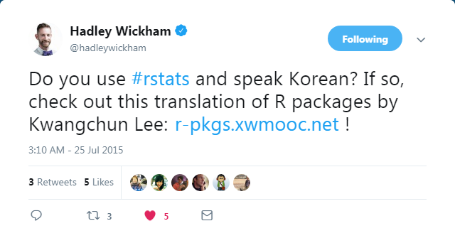

---
# Please do not edit this file directly; it is auto generated.
# Instead, please edit 15-packages.md in _episodes_rmd/
title: "R 팩키지 - 6월15일"
teaching: 180
exercises: 0
questions:
- "R 팩키지를 왜 만들까?"
- "함수와 문서를 함께 재사용하는 방법은 무엇인가?"
- "(엑셀) 데이터를 R 팩키지로 만들면 뭐가 좋을까요?"
objectives:
- "`library()` 사용을 벗어나 자체 팩키지를 개발한다."
- "R 팩키지 개발할 시점과 동기를 이해한다."
- "나만의 자체 팩키지를 개발한다."
keypoints:
- "데이터 기반 R 팩키지를 개발한다."
- "함수 기반 R 팩키지를 개발한다."
- "R 팩키지 개발관련 기반 기술을 이해한다."
source: Rmd
---

## R 팩키지 헬로월드

[R 팩키지 - 헬로우 월드](https://statkclee.github.io/data-science/r-pkg-hello-world.html)

## R 팩키지 이모저모

[tidyverse 기반 R 팩키지와 라이브러리](https://statkclee.github.io/data-science/data-science-library.html)

## 연관검색어 팩키지 개발 사례 

- [연관검색어 팩키지 - `suggestK`](https://statkclee.github.io/data-science/r-pkg-suggestK.html)

- [`suggestK`](https://github.com/statkclee/suggestK)

## 데이터 R 팩키지 

데이터 팩키지의 전형을 보여주는 [unvotes: United Nations General Assembly Voting Data](https://cran.r-project.org/web/packages/unvotes/index.html),
[`nycflights13`](https://github.com/hadley/nycflights13) 팩키지를 샅샅히 분해해서 이해한다.

- [UN 투표 데이터를 통해 본 한국과 주변 강대국](https://statkclee.github.io/data-science/ds-viz-un.html) 데이터 분석결과를 통해서 시간의 흐름에 따른 대한민국 외교정책의 미묘한 변화를 살펴본다.
- 대한민국 선거 데이터 [`krvotes`](https://github.com/statkclee/krvotes) R 데이터 팩키지를 살펴본다.

### **박찬엽 R 팩키지 사례 - [`seoulsurvey`](https://github.com/mrchypark/seoulsurvey)**

[서울서베이 도시정책지표조사 자료](http://data.si.re.kr/node/523) &rarr; [`seoulsurvey`](https://github.com/mrchypark/seoulsurvey)

<iframe width="300" height="180" src="https://www.youtube.com/embed/91w5_T979ME" frameborder="0" allow="accelerometer; autoplay; encrypted-media; gyroscope; picture-in-picture" allowfullscreen></iframe>

### **박찬엽 R 팩키지 사례 - [`krbudget2019`](https://github.com/mrchypark/krbudget2019)**

[서울경제 뉴스래빗 - 2019 정부 예산](http://newslabit.hankyung.com/article/201812187348G) &rarr; [`krbudget2019`](https://github.com/mrchypark/krbudget2019)

<iframe width="300" height="180" src="https://www.youtube.com/embed/-Sx5g158nRM" frameborder="0" allow="accelerometer; autoplay; encrypted-media; gyroscope; picture-in-picture" allowfullscreen></iframe>

## 데이터 R 팩키지 

