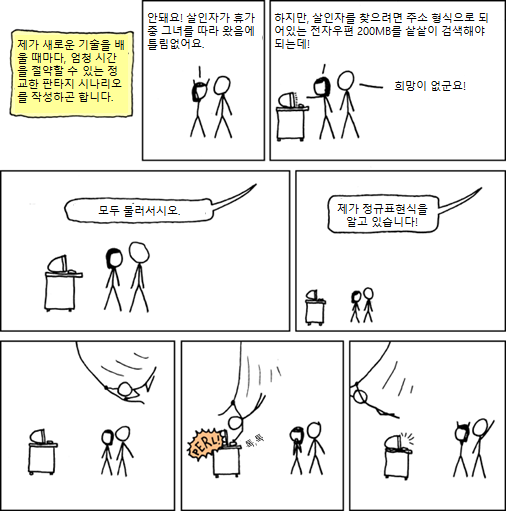

```{r, include=FALSE}
source("../bin/chunk-options.R")
knitr_fig_path("10-")
```


## 정규표현식 들어가며



출처: [xkcd: Regular Expressions](https://xkcd.com/208/)

## 정규표현식? 흠 ~~~

> - Some people, when confronted with a problem, think "I know, I'll use regular expressions." Now they have two problems.
> - Whenever faced with a problem, some people say "Lets use AWK." Now, they have two problems. — D. Tilbrook

## 정규표현식 자주 사용하는 패턴

- [정규표현식(Regular Expression) - `R`](https://statkclee.github.io/nlp2/regex-index.html)
    - `glue` 팩키지와 결합하여 다양한 활용사례를 만들 수 있음
    - [`stringdist`](https://github.com/markvanderloo/stringdist) 팩키지와 결합하여 오탈자 자동정정 및 화자 의도를 파악하는데 도움을 받을 수 있다.

## 정규표현식 학습교재

- 도서관 카펜트리 
    - [든든한 밑바탕](https://statkclee.github.io/lc-data-intro/03-foundations/index.html)
    - [정규 표현식](https://statkclee.github.io/lc-data-intro/04-regular-expressions/index.html)
- [`stringr`을 통해 문자열/텍스트 다루기](https://statkclee.github.io/text/nlp-stringr.html)
- [rebus](https://cran.r-project.org/web/packages/rebus/index.html)
    - [국내영화(건축학 개론) 등장인물 출현횟수](https://statkclee.github.io/text/nlp-movie-arch101.html)    
- [정보교육을 위한 파이썬](https://statkclee.github.io/pythonlearn-kr/01-py4inf-python2/) 
    - [유튜브 - 11장 정규표현식](https://www.youtube.com/watch?v=UR6a_wZ8ido&index=29&list=PLlRFEj9H3Oj4JXIwMwN1_ss1Tk8wZShEJ)

