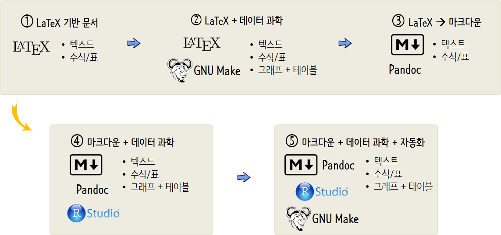

```{r, include=FALSE}
source("../bin/chunk-options.R")
knitr_fig_path("13-")
```

## [심각한 현재 상황](http://statkclee.github.io/modern-scientific-authoring/01-mess-kr.html) [^modern-writing]

[^modern-writing]: [현대적인 과학논문 저작](http://statkclee.github.io/modern-scientific-authoring/index-kr.html)

데이터 과학 시대 글쓰기 환경은 그전과 비교하여 변하지 않는 영역이 있는 반면 
인터넷, 클라우드, 재현가능한 과학연구, 과학 컴퓨팅, Git, 등 새로운 개념이 출현하면서 급변하고 있다.


1. [심각한 현재 상황](http://statkclee.github.io/modern-scientific-authoring/01-mess-kr.html)
1. [마크다운 기초](http://statkclee.github.io/modern-scientific-authoring/02-markdown-kr.html)	
1. [고급 마크다운](http://statkclee.github.io/modern-scientific-authoring/03-advanced-kr.html)	

## 데이터 과학자 저작 

- [데이터 과학을 위한 저작도구](https://statkclee.github.io/ds-authoring/slides/2016/ds_authoring_toolchain.html): [데이터야 놀자](https://datayanolja.github.io/) 2016-10-14(금), 마루 180, 서울 강남구 역삼로 180
- [글쓰기를 잘하기 위해서 알아야 되는 코딩](https://statkclee.github.io/ds-authoring/somul_20180525.html) [소프트웨어에 물들다](http://somul.kr/) (왕곡초등학교, 2018-05-26)
- 이제 글쓰기는 코딩이다. 강서양천신문 (’15년 9월)
    - [컴퓨터 사고력과 소프트웨어 교육](https://statkclee.github.io/ds-authoring/ct-korea.html) [원문](http://www.gynews.net/bbs/bbs.asp?exe=view&group_name=104&section=7&category=0&idx_num=19140&page=1&search_category=&search_word=&order_c=bd_idx_num&order_da=desc)
    - [글을 쓰는 것은 소프트웨어 개발이다!](https://statkclee.github.io/ds-authoring/ct-writing.html) [원문](http://www.gynews.net/bbs/bbs.asp?exe=view&group_name=104&section=7&category=0&idx_num=19311&page=1&search_category=&search_word=&order_c=bd_idx_num&order_da=desc)



## 단계별 데이터 과학 글쓰기 방법

- [재현가능한 논문 제작 환경](https://statkclee.github.io/author_carpentry_kr/authoring-tools.html)
- [R 마크다운 논문저작](https://statkclee.github.io/author_carpentry_kr/rmarkdown-authoring.html)

